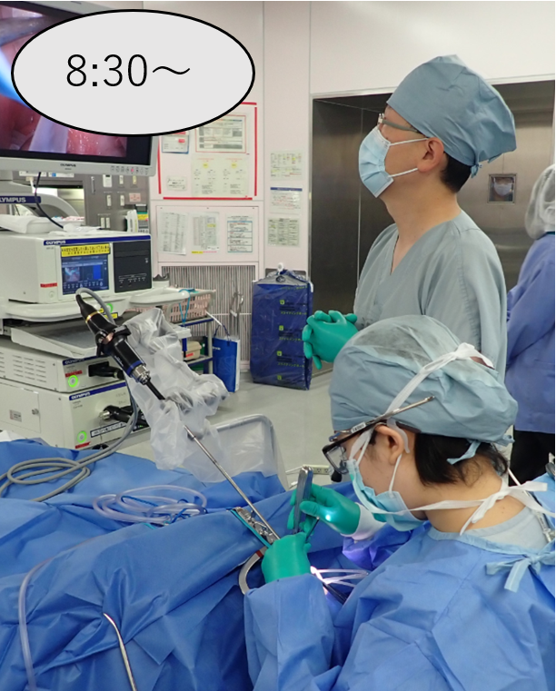

# 🏥 浜松医科大学 耳鼻咽喉科・頭頸部外科 新規ウェブサイト

> 浜松医科大学 耳鼻咽喉科・頭頸部外科 — 入局者・学生向け情報ポータルサイト


## 🚀 概要

Wix 製の既存サイトを完全コードベースで再構築した、学生・若手医師向けのモダンな情報ポータルサイトです。  
Tailwind CSS (CDN) + Vanilla JS の静的 HTML ファイル群で構築されており、ビルドツール不要で手軽にメンテナンス可能です。また、Wixから移行した過去のブログ記事や活動報告も内包しています。

## 📁 構成

```
new-ent-website/
├── index.html               # メインページ（Tailwind CSS + JS 完全内包）
├── introduction.html        # 教室紹介・教授挨拶ページ
├── student-clerkship.html   # 学生病院実習のご案内ページ
├── recruit.html             # 採用情報・専門研修ページ
├── staff.html               # スタッフ紹介ページ
├── affiliation.html         # 関連病院・連携施設ページ
├── daigaku.html             # 大学病院での研修スケジュールページ
├── sityuu.html              # 市中病院での研修スケジュールページ
├── gakkai-taikenki.html     # 学会体験記ページ
├── ryuugakuns-1.html        # 留学体験記（杉山先生）
├── ryuugakuss.html          # 留学体験記（佐原先生）
├── donation.html            # ご寄付のお願いページ
├── shukugakai.html          # 祝賀会のご報告ページ（星野名誉教授米寿・峯田名誉教授古希・中西教授就任）
├── shinobukai.html          # 偲ぶ会と祝賀会のご報告ページ（野末名誉教授偲ぶ会・峯田教授退任・三澤教授就任・瀧澤准教授就任）
├── pdf-library.html         # PDF資料室ページ（各種広報・受賞報告・関連病院紹介パンフレット等）
├── pdf-data.js              # PDF資料室のデータ定義ファイル（JSオブジェクト配列）
├── blog.html                # ブログ・活動報告一覧ページ
├── blog/                    # 個別ブログ記事HTML配置フォルダ
├── images/                  # イラスト・写真アセット配置フォルダ
├── rules.md                 # プロジェクトルール
└── README.md
```

## 🛠 ローカル確認

```bash
# ブラウザで直接開くだけで動作します
start index.html
```

## ☁️ デプロイ (Cloudflare Pages)

1. GitHub にプッシュ
2. Cloudflare Pages ダッシュボードでこのリポジトリを接続
3. ビルドコマンド: なし（静的ファイル）
4. 公開ディレクトリ: `/`（ルート）

## 📷 画像アセットの追加・差し替え

`images/` フォルダに写真を配置し、該当する HTML 内の `img` タグの `src` を更新してください。

```html
<!-- 差し替え例 -->

```

